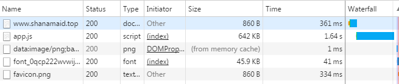
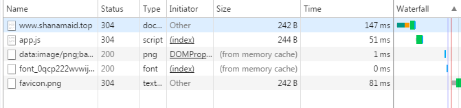
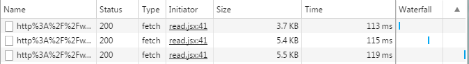

# oho-reader
哦豁阅读器！API源自追书神器，免费使用！目前已初步开发完成！

实现追书神器核心功能，做到小说阅读的极简体验，把每一分流量都用到刀刃上！

Github项目地址:[https://github.com/ShanaMaid/oho-reader](https://github.com/ShanaMaid/oho-reader)

欢迎`issue`，`pr`，`star` or `follow`！我将继续开源更多有趣的项目

推荐一个之前用Vue全家桶写的 [网易云音乐PC端 web版本](https://github.com/ShanaMaid/vue-163-music)

## 在线版
[http://119.29.159.156:3001/](http://119.29.159.156:3001/)

## 部分效果截图


[更多效果gif图](screenshot/)

## oho阅读器优势
|     | oho阅读器 |  追书神器|
|-----|-----------|----------|
|收费 | 免费      |部分章节免费,其余收费|
|广告 |绿色无广告 | 定时刷广告|
|体积 | 4MB     | 16.2MB   |
|章节大小| 每章5kb左右   | 掺杂广告，大于5kb|

oho阅读器初次打开时候加载比较慢，一部分原因是服务器带宽较小，另一部分是因为初次需要下载`700kb`左右的文件，建议初次下载在wifi下进行。初次下载后oho阅读器会自动进行缓存，以后每次打开页面基本是秒开，消耗流量约在`1KB`不到。



初次打开消耗流量约在700kb左右



后续打开消耗流量约在1kb不到

同时oho器抛弃所有与小说阅读无关的信息，真正做到极简！保证每一分流量都用到小说内容的阅读上，真正做到每章内容加载所用的流量集中在小说章节内容上，视章节字数而定，一般在`5kb`左右。



每章流量消耗

## 使用
```
git clone https://github.com/ShanaMaid/oho-reader.git

cd oho-reader

npm install 

# 开发环境
npm run serve
访问 http://localhost:8080/

# 打包
npm run dist

# 实际环境
cd dist
node app.js
访问 http://localhost:3001/
```

Docker:
方便在Docker下部署
[Docker-file](https://hub.docker.com/r/esme518/docker-oho-reader/)

感谢[@esme518](https://github.com/esme518)提供

## 实现功能
- [x] 小说搜索
- [x] 小说详情
- [x] 小说换源
- [x] 小说阅读
- [x] 小说分享
- [x] 阅读字体大小变化
- [x] 阅读背景色变化
- [x] 阅读设置本地缓存
- [x] 阅读进度本地缓存
- [x] 搜索历史本地缓存
- [x] 小说章节缓存(100章)-智能删除已阅读章节


每次进入首页自动刷新最新章节列表

## 目录结构
```
|
|—— api 追书神器API说明 
|—— cfg webpack配置
|—— dist 服务端
| |—— app.js 服务端启动入口文件
| |—— assets 打包后的资源文件
| |—— static 静态资源
| |__ index.html 网页入口
|
|——src 资源文件
| |—— images 图片资源
| |—— components 组件库
| |—— method  一些自定义方法，目前是过滤器
| |—— filters 自定义过滤器
| |—— redux 
| | |—— action
| | |—— reducer
| | |__ store
| |—— router 路由管理
| |—— styles 样式文件
| |__ index.jsx 入口
|_________________________________________________

```

## 一些注意事项
项目中使用追书神器的接口，需要使用`http-proxy-middleware`进行转发，开发环境下需要在`cfg/base.js`中的`dev`中添加下列配置即可
```
proxy: {
  '/api': {
    target: 'http://api.zhuishushenqi.com/',
    pathRewrite: {'^/api' : '/'},
    changeOrigin: true
  },
  '/chapter': {
    target: 'http://chapter2.zhuishushenqi.com/',
    pathRewrite: {'^/chapter' : '/chapter'},
    changeOrigin: true
  }
}
```

实际环境中，服务器端配置
```
var express = require('express');
var proxy = require('http-proxy-middleware');

var app = express();
app.use('/static', express.static('static'));
app.use('/assets', express.static('assets'));
app.use('/api', proxy({
  target: 'http://api.zhuishushenqi.com/',
  pathRewrite: {'^/api' : '/'}, 
  changeOrigin: true
}
));

app.use('/chapter', proxy({
  target: 'http://chapter2.zhuishushenqi.com/',
  pathRewrite: {'^/chapter' : '/chapter'},
  changeOrigin: true
}
));

app.get('/*', function (req, res) {
  res.sendFile(__dirname + '/index.html');
});
app.listen(3001);
```

## 支持
BUG提交请发送邮箱: uestczeng@gmail.com

欢迎`issue`，`pr`，`star` or `follow`！我将继续开源更多有趣的项目

[你可以在这里打赏我](http://blog.shanamaid.top/sponsor/)

你的支持将有助于项目维护以及提高用户体验，感谢各位的支持！

## 特别鸣谢
感谢[@hieixu](https://github.com/hieixu)对本项目的长期跟进，提出了许多`issue`改进用户体验以及打赏支持

